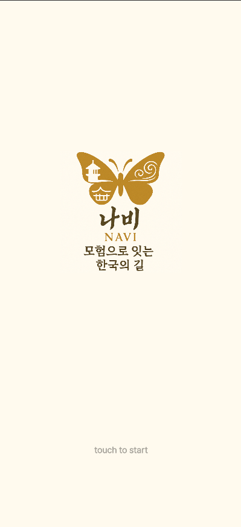
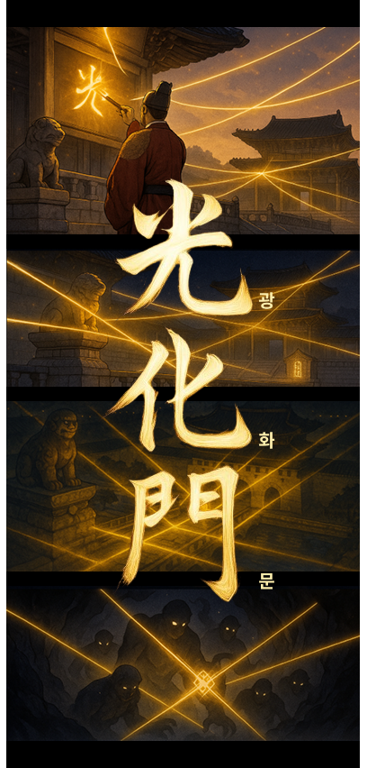
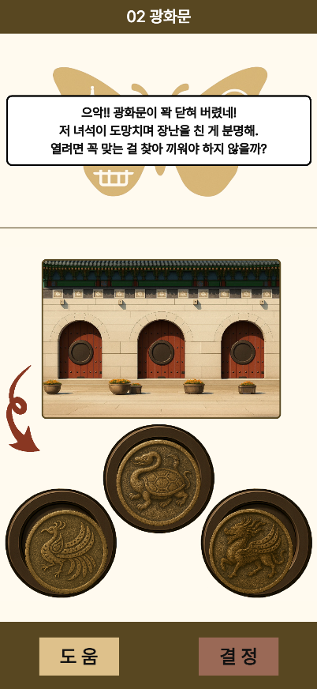
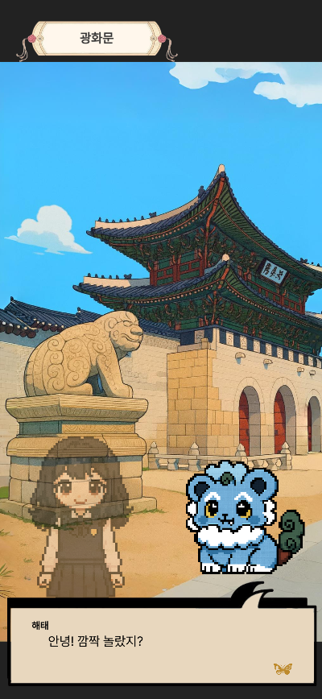
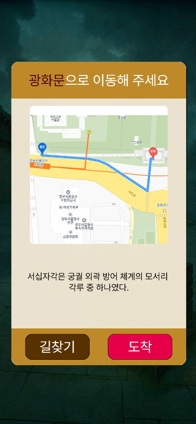

# NAVI: 모험으로 잇는 한국의 길 🏯
> **한국을 배경으로 한 스토리 기반 퍼즐 어드벤처 게임**  
> 첫 번째 시나리오: **경복궁**

---

## 🎮 프로젝트 개요
NAVI는 한국을 배경으로 한 **위치 기반 스토리형 퍼즐 게임**입니다.  
플레이어는 실제 장소를 탐험하며 NPC와 대화하고 퍼즐을 풀고,  
아이템을 수집하면서 한국의 여러 장소를 모험할 수 있습니다.  

- **시나리오 확장형**: 한국의 여러 지역에 새로운 시나리오 추가 가능
- **스토리 + 퍼즐 융합**: 한국 요괴, 전설, 역사적 사건을 기반으로 한 서사  
- **플랫폼**: 웹 버전(PC/모바일 브라우저) → 차후 앱 출시 예정  

👉 [데모 플레이 (Vercel 배포)](https://navi-green-ten.vercel.app/)  

---

## 🛠 기술 스택

### 🎨 Frontend

### ⚙️ Backend

### 🗄 Database & Infra

---

## 👥 기여자

- #### 김승호 – Backend/Frontend 개발, 기획
- #### 박준서 - Backend/Frontend 개발, 기획
- #### 현수민 - Frontend 개발, 디자인, 기획, 문제설계

---

## 📸 스크린샷

  
  
  
  
  

